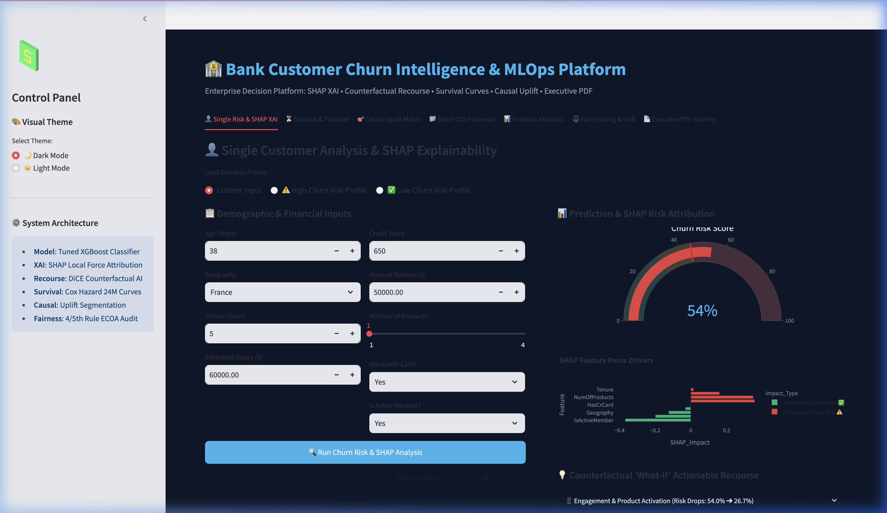
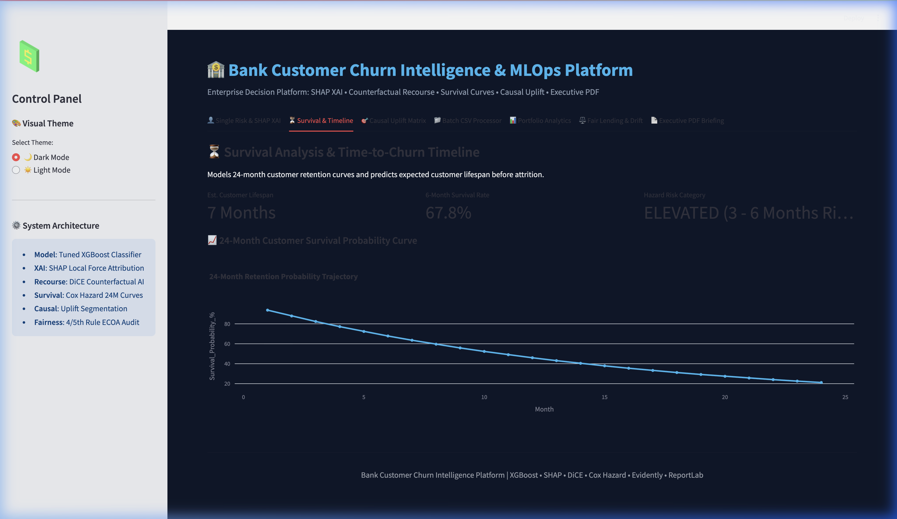
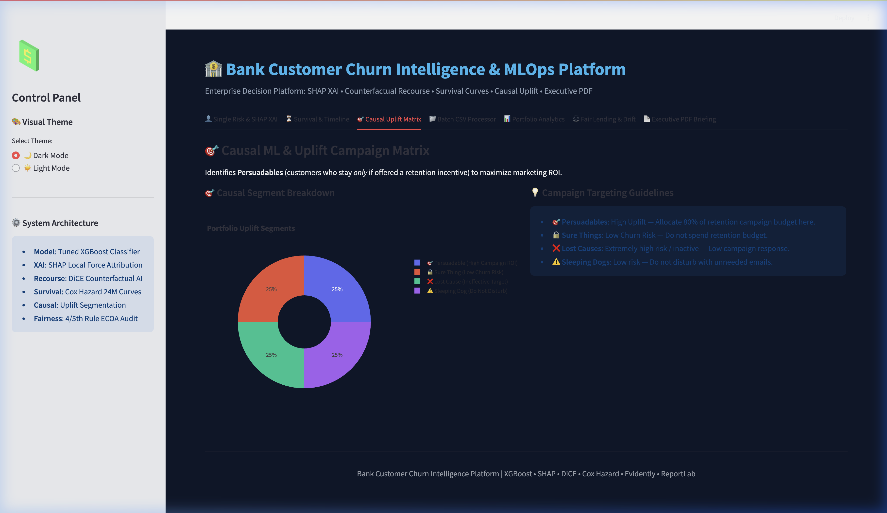
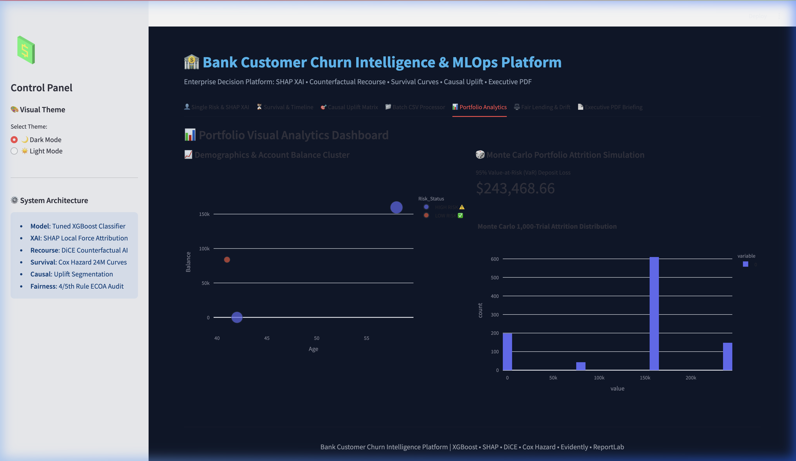
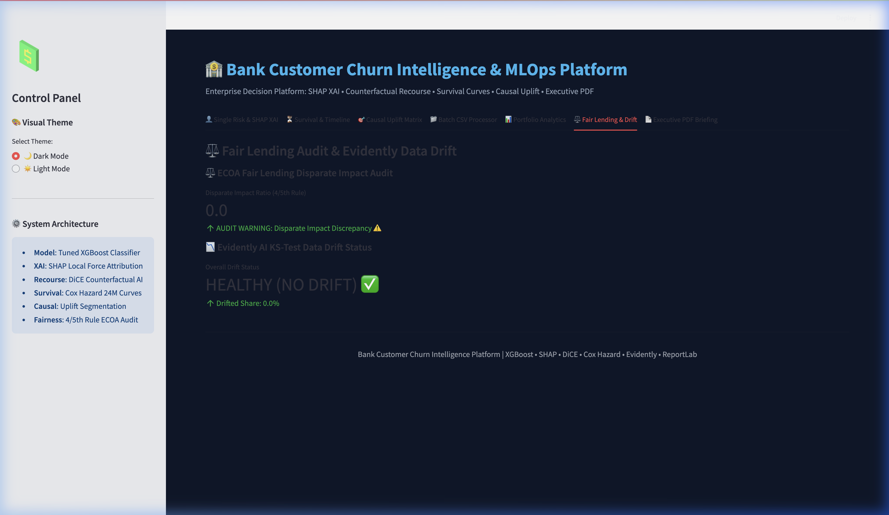
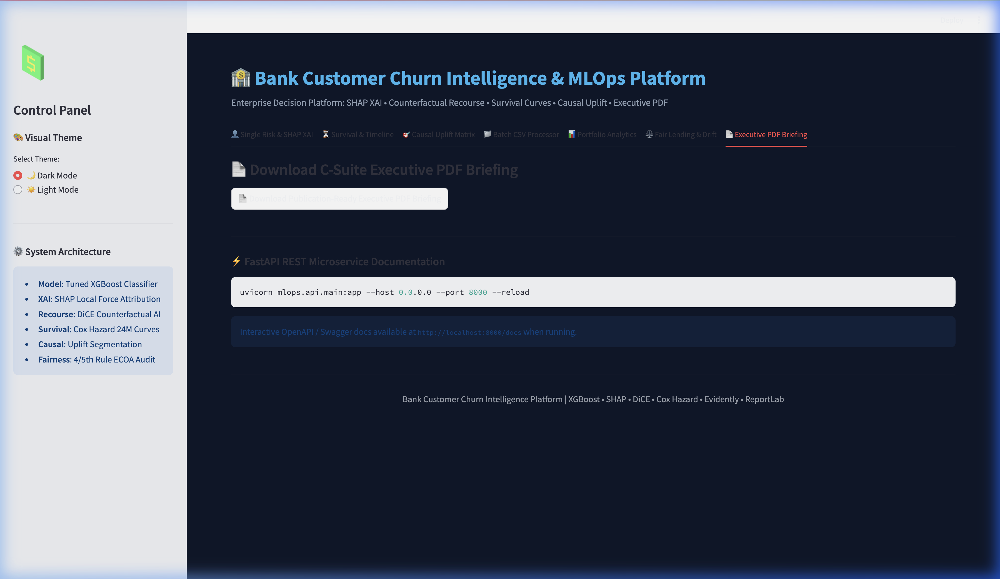
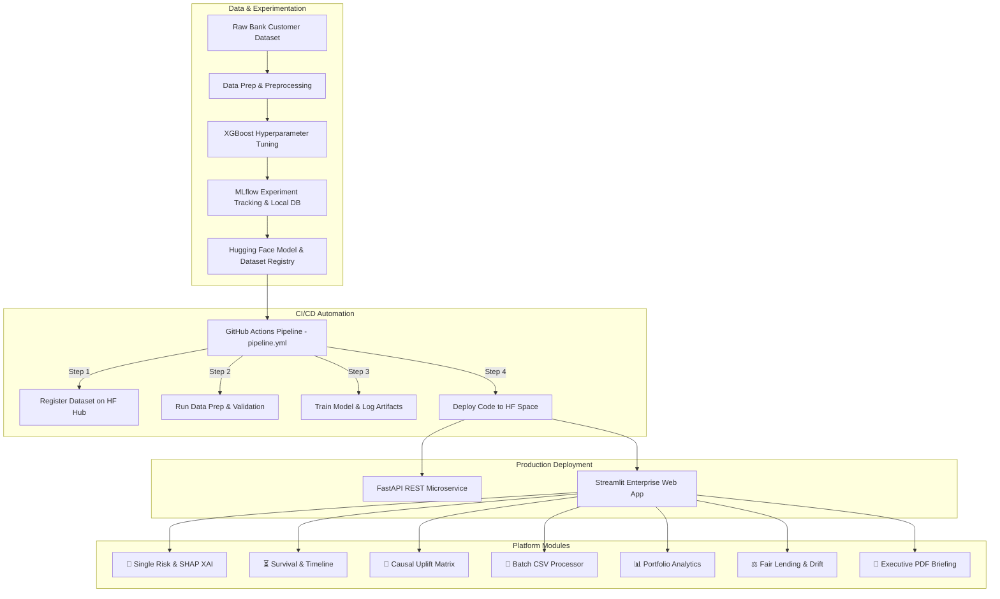

# 🏦 Bank Customer Churn Intelligence & MLOps Platform

<div align="center">


---

### **Enterprise ML Systems Engineering for Financial Attrition Prediction, Explainable AI (XAI), Survival Analysis, Causal Uplift Modeling, Fair Lending Audits & Automated C-Suite PDF Governance**

</div>

---

## 🔗 Quick Links & Live Demonstrations

| Resource | Description | Direct Link |
| :--- | :--- | :--- |
| 🌐 **Live Interactive Web App** | Production Streamlit Platform hosted on Hugging Face Spaces | [](https://huggingface.co/spaces/krish21may/Bank-Customer-Churn-4) |
| 🤗 **Hugging Face Model Registry** | Serialized Production Model & Metadata Storage | [](https://huggingface.co/krish21may/Bank-Customer-Churn-4) |
| 🐙 **GitHub Repository** | Source Code & MLOps Infrastructure | [](https://github.com/krish2105/Project-4-SDAIM) |
| ⚡ **CI/CD Pipeline** | Automated Build, Train & Deploy Workflow | [](https://github.com/krish2105/Project-4-SDAIM/actions) |
| ⚡ **FastAPI REST Swagger Docs** | Interactive API Schema & Endpoint Testing (Local) | `http://localhost:8000/docs` |

---

## 🌟 Executive Summary & Platform Capabilities

The **Bank Customer Churn Intelligence & MLOps Platform** is an enterprise-grade solution engineered to predict, understand, and mitigate customer attrition for financial institutions. Going beyond raw risk probability scoring, this platform bridges machine learning engineering with financial strategy, offering:

- 🎯 **Predictive ML Modeling**: High-precision XGBoost classifier fine-tuned to capture subtle churn indicators.
- 👤 **SHAP Local Force Attribution**: Precise individual feature contributions (e.g., impact of Age, Balance, or Product Count on churn risk).
- 💡 **DiCE Counterfactual "What-If" Recourse**: Actionable, minimal-change recommendations to transition a customer from high-risk to safe status.
- ⏳ **Cox Proportional Hazards Survival Timelines**: 24-month survival curves estimating expected tenure and probability of retention over time.
- 🎯 **Causal ML Uplift Segmentation**: Classifies customers into **Persuadables**, **Sure Things**, **Lost Causes**, and **Sleeping Dogs** to maximize marketing ROI.
- ✉️ **LLM Retention Outreach Generator**: Personalized, context-aware retention communication tailored to risk factors.
- ⚖️ **ECOA Fair Lending Audit**: Disparate Impact Ratio analysis (4/5th Rule) evaluating bias across age groups and geographies for regulatory compliance.
- 📊 **Evidently AI Drift Monitoring**: Kolmogorov-Smirnov statistical tests detecting covariate and data drift in production features.
- 🎲 **Monte Carlo Deposit Attrition VaR Simulation**: 1,000-trial financial simulation calculating Value-at-Risk ($VaR_{95}$) for portfolio balance outflow.
- 📄 **Automated ReportLab C-Suite PDF Briefings**: On-demand generation of executive-level governance reports.

---

## 📸 Platform Interface & Screenshots

### 1. 👤 Single Customer Analysis & SHAP XAI
*Interactive risk calculator featuring gauge scoring, SHAP feature force attribution, DiCE counterfactual recourse scenarios, and LLM retention copywriting.*



---

### 2. ⏳ Survival Analysis & 24-Month Timeline
*Cox Proportional Hazard survival probability curves projecting customer retention trajectories over a 24-month time horizon.*



---

### 3. 🎯 Causal Uplift Matrix & Marketing ROI Optimization
*Causal ML segmentation dividing customers into persuasive tiers to prevent wasted incentive spend on Lost Causes or Sleeping Dogs.*



---

### 4. 📊 Portfolio Analytics & Financial Risk Matrix
*Macro-level overview of portfolio balance exposure, churn density across demographic segments, and customer lifetime value distributions.*



---

### 5. ⚖️ ECOA Fair Lending Audit & Data Drift Monitoring
*Regulatory compliance suite running Disparate Impact Ratios (4/5th Rule) alongside Kolmogorov-Smirnov drift detection via Evidently AI.*



---

### 6. 📄 Automated Executive PDF Governance Briefing
*One-click ReportLab PDF generator compiling executive summaries, key risk charts, and audit metrics into printable documents.*



---

## 🏛️ System Architecture & MLOps Pipeline



---

## 📁 Repository Structure

```
Project-4-SDAIM/
│
├── .github/
│   └── workflows/
│       └── pipeline.yml         # GitHub Actions automated CI/CD pipeline
│
├── assets/
│   └── screenshots/             # High-resolution platform UI screenshots
│       ├── main_dashboard.png
│       ├── survival_timeline.png
│       ├── causal_uplift.png
│       ├── portfolio_analytics.png
│       ├── fair_lending_drift.png
│       └── executive_pdf.png
│
├── mlops/                       # Core MLOps & ML application package
│   ├── analytics/               # Advanced analytical engine modules
│   │   ├── counterfactual.py    # DiCE counterfactual recourse generator
│   │   ├── fairness_audit.py    # ECOA fair lending 4/5th rule audit
│   │   ├── llm_outreach.py      # LLM retention email & SMS copywriter
│   │   ├── monte_carlo_sim.py   # Portfolio deposit VaR Monte Carlo engine
│   │   ├── roi_calculator.py    # CLV & financial retention ROI optimizer
│   │   ├── shap_explainer.py    # SHAP local feature impact calculator
│   │   ├── survival_analysis.py # Cox Proportional Hazards 24M survival engine
│   │   └── uplift_modeling.py   # Causal uplift 4-quadrant segmentation
│   │
│   ├── api/                     # Microservice layer
│   │   └── main.py              # FastAPI application & endpoints
│   │
│   ├── data/                    # Dataset directory
│   │   └── bank_customer_churn.csv
│   │
│   ├── deployment/              # Production web application
│   │   ├── app.py               # 7-Tab Streamlit enterprise platform
│   │   └── Dockerfile           # Container definition for HF Space
│   │
│   ├── hosting/                 # Automated Hugging Face Hub sync
│   │   └── hosting.py           # Deployment push script
│   │
│   ├── model_building/          # MLOps training & pipeline scripts
│   │   ├── data_register.py     # HF Hub dataset uploader
│   │   ├── prep.py              # Preprocessing & train-test splitter
│   │   └── train.py             # MLflow tracked XGBoost training script
│   │
│   ├── monitoring/              # Production observability
│   │   └── drift_monitor.py     # Kolmogorov-Smirnov feature drift analyzer
│   │
│   ├── reports/                 # Governance document generation
│   │   └── pdf_generator.py     # ReportLab C-Suite PDF report builder
│   │
│   └── requirements.txt         # Production dependency requirements
│
├── MLOps_ _CICD_ _Experimentation_w_Github_Actions (1).ipynb
├── mlflow.db                    # MLflow SQLite backend store
├── pipeline.yml                 # Standalone pipeline configuration
├── README.md                    # Platform documentation
├── Xtrain.csv                   # Preprocessed training feature set
├── Xtest.csv                    # Preprocessed testing feature set
├── ytrain.csv                   # Preprocessed training targets
└── ytest.csv                    # Preprocessed testing targets
```

---

## ⚡ Quickstart & Local Setup Guide

### 1. Clone Repository & Setup Virtual Environment

```bash
git clone https://github.com/krish2105/Project-4-SDAIM.git
cd Project-4-SDAIM

# Create and activate virtual environment
python3 -m venv venv
source venv/bin/activate   # On Windows: venv\Scripts\activate
```

### 2. Install Dependencies

```bash
pip install -r mlops/requirements.txt
```

### 3. Launch Interactive Streamlit Web Platform

```bash
streamlit run mlops/deployment/app.py
```
*Access the platform in your browser at `http://localhost:8501`.*

### 4. Launch FastAPI REST Microservice

```bash
uvicorn mlops.api.main:app --host 0.0.0.0 --port 8000 --reload
```
*Interactive Swagger API documentation is available at `http://localhost:8000/docs`.*

---

## 🚀 Model Training & MLOps Operations

### Execute End-to-End Training Pipeline Locally

To register data, preprocess features, and train the model with MLflow metric tracking:

```bash
# 1. Upload & Register Dataset
python mlops/model_building/data_register.py

# 2. Run Data Preprocessing
python mlops/model_building/prep.py

# 3. Train Model & Log to MLflow
python mlops/model_building/train.py
```

### View MLflow Experiment Tracking Dashboard

```bash
mlflow ui --backend-store-uri sqlite:///mlflow.db --port 5000
```
*Open `http://localhost:5000` to inspect experiment runs, metrics (ROC-AUC, F1-Score), and model artifacts.*

---

## 🌐 FastAPI Microservice Endpoints

| Endpoint | Method | Description | Sample Payload |
| :--- | :--- | :--- | :--- |
| `/v1/health` | `GET` | Microservice & model readiness check | N/A |
| `/v1/predict` | `POST` | Single customer churn risk score & SHAP attribution | JSON with customer metrics |
| `/v1/predict-batch` | `POST` | Batch CSV/JSON churn risk inference | Array of customer objects |
| `/v1/drift-check` | `POST` | Run KS-Test data drift evaluation on incoming sample | Batch feature array |

### Example `curl` Request for Single Risk Prediction

```bash
curl -X 'POST' \
  'http://localhost:8000/v1/predict' \
  -H 'accept: application/json' \
  -H 'Content-Type: application/json' \
  -d '{
  "CreditScore": 650,
  "Geography": "Germany",
  "Age": 45,
  "Tenure": 3,
  "Balance": 120000.0,
  "NumOfProducts": 1,
  "HasCrCard": 1,
  "IsActiveMember": 0,
  "EstimatedSalary": 75000.0
}'
```

---

## 🔄 CI/CD Pipeline & Automated Deployment Strategy

The project utilizes **GitHub Actions** (`.github/workflows/pipeline.yml`) to achieve full continuous integration and deployment on every `push` to the `main` branch:

1. **Dataset Registration (`register-dataset`)**: Connects via Hugging Face Hub API (`HF_TOKEN`) and updates raw dataset repositories.
2. **Data Preprocessing (`data-prep`)**: Executes clean splits, scales numeric features, and exports canonical `Xtrain`, `Xtest`, `ytrain`, and `ytest`.
3. **Model Building & MLflow Tracking (`model-traning`)**: Launches an automated MLflow UI backend, executes hyperparameter tuning on XGBoost, and commits model weights to Hugging Face Model Hub.
4. **Automated Hosting Deployment (`deploy-hosting`)**: Syncs updated application scripts (`app.py`), analytical dependencies, and Docker configurations directly to the live **Hugging Face Space**.

---

## 📜 License & Author Information

- **Author**: Krish Mathur
- **Repository**: [krish2105/Project-4-SDAIM](https://github.com/krish2105/Project-4-SDAIM)
- **Hugging Face Hub**: [krish21may](https://huggingface.co/krish21may)
- **License**: MIT License - open for educational, personal, and commercial research applications.

---

<div align="center">
  <sub>Built with ❤️ using Python, FastAPI, Streamlit, XGBoost, MLflow, and Hugging Face.</sub>
</div>
