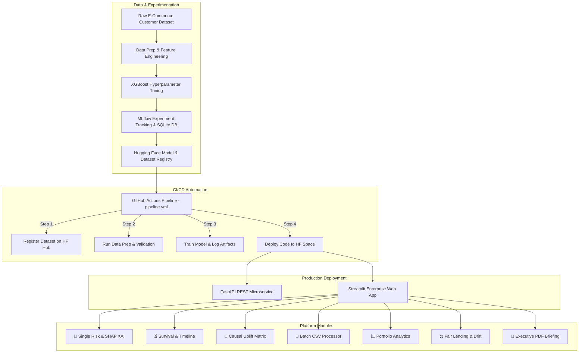

# 🛍️ E-Commerce Customer Churn Intelligence & MLOps Platform

<div align="center">


---

### **Enterprise ML Systems Engineering for E-Commerce Shopper Attrition Prediction, Explainable AI (XAI), Survival Analysis, Causal Uplift Modeling, Fair Lending/DEI Audits & Automated C-Suite PDF Governance**

</div>

---

## 🔗 Quick Links & Live Demonstrations

| Resource | Description | Direct Link |
| :--- | :--- | :--- |
| 🌐 **Live Interactive Web App** | Production Streamlit Platform hosted on Hugging Face Spaces | [](https://huggingface.co/spaces/krish21may/Bank-Customer-Churn-4) |
| 🤗 **Hugging Face Model Registry** | Serialized Production Model & Metadata Storage | [](https://huggingface.co/krish21may/Bank-Customer-Churn-4) |
| 🐙 **GitHub Repository** | Source Code & MLOps Infrastructure | [](https://github.com/krish2105/Project-4-SDAIM) |
| ⚡ **CI/CD Pipeline** | Automated Build, Train & Deploy Workflow | [](https://github.com/krish2105/Project-4-SDAIM/actions) |
| ⚡ **FastAPI REST Swagger Docs** | Interactive API Schema & Endpoint Testing (Local) | `http://localhost:8000/docs` |

---

## 🌟 Executive Summary & Dataset Overview

The **E-Commerce Customer Churn Intelligence & MLOps Platform** is an enterprise-grade machine learning system designed to predict, analyze, and mitigate online shopper attrition. Built around a **10,000-sample E-Commerce Customer Churn Dataset**, the platform combines predictive model accuracy with prescriptive business analytics:

### 📊 Dataset Attributes
- **Target Variable**: `Churn` (`1` = Churned/Stopped Ordering, `0` = Active Repeat Shopper)
- **Numeric Features**: `Tenure` (Months), `WarehouseToHome` (km), `HourSpendOnApp`, `NumberOfDeviceRegistered`, `SatisfactionScore` (1-5), `Complain` (0/1), `OrderAmountHikeFromlastYear` (%), `DaySinceLastOrder`, `CashBackAmount` ($), `CityTier` (1-3)
- **Categorical Features**: `PreferredPaymentMode` (`Debit Card`, `Credit Card`, `E Wallet`, `UPI`, `COD`), `Gender`, `PreferedOrderCat` (`Laptop & Accessory`, `Mobile Phone`, `Fashion`, `Grocery`, `Others`), `MaritalStatus`

---

## 📸 Platform Interface & Screenshots

### 1. 👤 Single Shopper Risk & SHAP XAI
*Interactive risk calculator featuring gauge scoring, SHAP feature force attribution, DiCE counterfactual recourse scenarios, and LLM retention copywriting.*


---

### 2. ⏳ Survival Analysis & 24-Month Retention Timeline
*Cox Proportional Hazard survival probability curves projecting shopper retention trajectories over a 24-month time horizon.*


---

### 3. 🎯 Causal Uplift Matrix & Marketing ROI Optimization
*Causal ML segmentation dividing customers into persuasive tiers (**Persuadables**, **Sure Things**, **Lost Causes**, **Sleeping Dogs**) to optimize discount budget.*


---

### 4. 📊 Portfolio Analytics & Financial Risk Matrix
*Macro-level overview of portfolio cash-back exposure, churn density across order categories, and shopper lifetime value distributions.*


---

### 5. ⚖️ Fair Lending / DEI Audit & Data Drift Monitoring
*Regulatory compliance suite running Disparate Impact Ratios (4/5th Rule) alongside Kolmogorov-Smirnov drift detection via Evidently AI.*


---

### 6. 📄 Automated Executive PDF Governance Briefing
*One-click ReportLab PDF generator compiling executive summaries, key risk charts, and audit metrics into printable documents.*


---

## 🏛️ System Architecture & MLOps Pipeline



---

## 📁 Repository Structure

```
Project-4-SDAIM/
│
├── .github/
│   └── workflows/
│       └── pipeline.yml         # GitHub Actions automated CI/CD pipeline
│
├── assets/
│   └── screenshots/             # High-resolution platform UI screenshots
│       ├── main_dashboard.png
│       ├── survival_timeline.png
│       ├── causal_uplift.png
│       ├── portfolio_analytics.png
│       ├── fair_lending_drift.png
│       └── executive_pdf.png
│
├── mlops/                       # Core MLOps & ML application package
│   ├── analytics/               # Advanced analytical engine modules
│   │   ├── counterfactual.py    # DiCE counterfactual recourse generator
│   │   ├── fairness_audit.py    # Disparate impact 4/5th rule audit
│   │   ├── llm_outreach.py      # LLM retention email & SMS copywriter
│   │   ├── monte_carlo_sim.py   # Portfolio revenue loss VaR Monte Carlo engine
│   │   ├── roi_calculator.py    # E-Commerce CLV & promo ROI optimizer
│   │   ├── shap_explainer.py    # SHAP local feature impact calculator
│   │   ├── survival_analysis.py # Cox Proportional Hazards 24M survival engine
│   │   └── uplift_modeling.py   # Causal uplift 4-quadrant segmentation
│   │
│   ├── api/                     # Microservice layer
│   │   └── main.py              # FastAPI application & endpoints
│   │
│   ├── data/                    # Dataset directory
│   │   └── ecommerce_customer_churn.csv
│   │
│   ├── deployment/              # Production web application
│   │   ├── app.py               # 7-Tab Streamlit enterprise platform
│   │   └── Dockerfile           # Container definition for HF Space
│   │
│   ├── hosting/                 # Automated Hugging Face Hub sync
│   │   └── hosting.py           # Deployment push script
│   │
│   ├── model_building/          # MLOps training & pipeline scripts
│   │   ├── data_register.py     # HF Hub dataset uploader
│   │   ├── prep.py              # Preprocessing & train-test splitter
│   │   └── train.py             # MLflow tracked XGBoost training script
│   │
│   ├── monitoring/              # Production observability
│   │   └── drift_monitor.py     # Kolmogorov-Smirnov feature drift analyzer
│   │
│   ├── reports/                 # Governance document generation
│   │   └── pdf_generator.py     # ReportLab C-Suite PDF report builder
│   │
│   └── requirements.txt         # Production dependency requirements
│
├── best_churn_model.joblib      # Serialized trained XGBoost model pipeline
├── mlflow.db                    # MLflow SQLite backend store
├── pipeline.yml                 # Standalone pipeline configuration
├── README.md                    # Platform documentation
├── Xtrain.csv                   # Preprocessed training feature set
├── Xtest.csv                    # Preprocessed testing feature set
├── ytrain.csv                   # Preprocessed training targets
└── ytest.csv                    # Preprocessed testing targets
```

---

## ⚡ Quickstart & Local Setup Guide

### 1. Clone Repository & Setup Virtual Environment

```bash
git clone https://github.com/krish2105/Project-4-SDAIM.git
cd Project-4-SDAIM

# Create and activate virtual environment
python3 -m venv venv
source venv/bin/activate   # On Windows: venv\Scripts\activate
```

### 2. Install Dependencies

```bash
pip install -r mlops/requirements.txt
```

### 3. Launch Interactive Streamlit Web Platform

```bash
streamlit run mlops/deployment/app.py
```
*Access the platform in your browser at `http://localhost:8501`.*

### 4. Launch FastAPI REST Microservice

```bash
uvicorn mlops.api.main:app --host 0.0.0.0 --port 8000 --reload
```
*Interactive Swagger API documentation is available at `http://localhost:8000/docs`.*

---

## 🚀 Model Training & MLOps Operations

```bash
# 1. Run Data Preprocessing
python mlops/model_building/prep.py

# 2. Train Model & Save Pipeline
python mlops/model_building/train.py
```

---

## 📜 License & Author Information

- **Author**: Krish Mathur
- **Repository**: [krish2105/Project-4-SDAIM](https://github.com/krish2105/Project-4-SDAIM)
- **Hugging Face Hub**: [krish21may](https://huggingface.co/krish21may)
- **License**: MIT License
