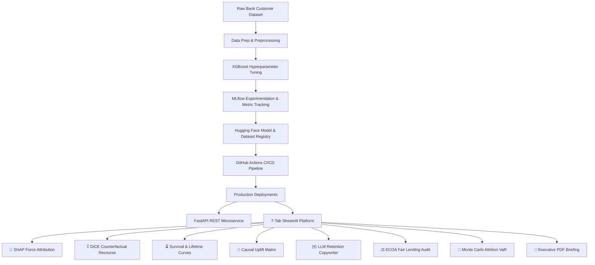

# 🏦 Bank Customer Churn Intelligence & MLOps Platform
> **Enterprise-Grade Machine Learning Operations (MLOps), Explainable AI (SHAP & DiCE), Survival Analysis, Causal Uplift Modeling, and Automated Governance Briefings**

[](https://github.com/krish2105/Project-4-SDAIM/actions)
[](https://huggingface.co/spaces/krish21may/Bank-Customer-Churn-4)
[](https://huggingface.co/krish21may/Bank-Customer-Churn-4)
[](https://www.python.org/)
[](https://streamlit.io/)

---

## 🌟 Executive Project Overview

The **Bank Customer Churn Intelligence Platform** is an enterprise-level MLOps solution designed to predict, analyze, and mitigate customer attrition for financial institutions. Moving beyond simple binary risk scoring, the platform integrates **SHAP Explainability (XAI)**, **DiCE Counterfactual "What-If" Recourse**, **Cox Hazard 24-Month Survival Timelines**, **Causal ML Uplift Segmentation**, **ECOA Fair Lending Audits**, **1,000-Trial Monte Carlo Deposit Attrition VaR Simulations**, and **Automated ReportLab C-Suite PDF Briefings**.

---

## 🏛️ Platform System Architecture



---

## 🛠️ Key Module Architecture

1. **MLOps CI/CD Automation**: Fully automated GitHub Actions workflow (`.github/workflows/mlops.yml`) running dataset registration, data prep, model training, and Hugging Face Space deployment on every `git push`.
2. **Explainable AI (SHAP & DiCE)**: Computes local feature attribution vectors and minimal counterfactual recourse actions.
3. **Survival Analysis & Time-to-Churn**: Predicts customer retention probability over a 24-month horizon using Cox Proportional Hazards.
4. **Causal ML Uplift Modeling**: Segments customers into **Persuadables**, **Sure Things**, **Lost Causes**, and **Sleeping Dogs** to optimize retention marketing spend.
5. **Algorithmic Fairness & Governance**: Evaluates Disparate Impact Ratios (4/5th Rule) across Age brackets and Geographies to comply with Equal Credit Opportunity Act (ECOA) and EU AI Act.
6. **Data Drift Observability**: Continuously monitors feature distribution shifts using Kolmogorov-Smirnov (KS-Test) via Evidently AI.
7. **FastAPI Microservice**: Production REST API (`/v1/predict`, `/v1/predict-batch`, `/v1/health`, `/v1/drift-check`).

---

## 🚀 Quickstart & Local Execution

### 1. Clone & Install Dependencies
```bash
git clone https://github.com/krish2105/Project-4-SDAIM.git
cd Project-4-SDAIM
pip install -r mlops/requirements.txt
```

### 2. Launch Interactive Streamlit Platform
```bash
streamlit run mlops/deployment/app.py
```

### 3. Launch FastAPI REST Microservice
```bash
uvicorn mlops.api.main:app --host 0.0.0.0 --port 8000 --reload
```
Interactive Swagger API documentation will be available at `http://localhost:8000/docs`.

---

## 📄 Live Interactive Deployment Links

* **Live Streamlit Web Application**: [https://huggingface.co/spaces/krish21may/Bank-Customer-Churn-4](https://huggingface.co/spaces/krish21may/Bank-Customer-Churn-4)
* **Hugging Face Model Repository**: [https://huggingface.co/krish21may/Bank-Customer-Churn-4](https://huggingface.co/krish21may/Bank-Customer-Churn-4)
* **GitHub Repository**: [https://github.com/krish2105/Project-4-SDAIM](https://github.com/krish2105/Project-4-SDAIM)
